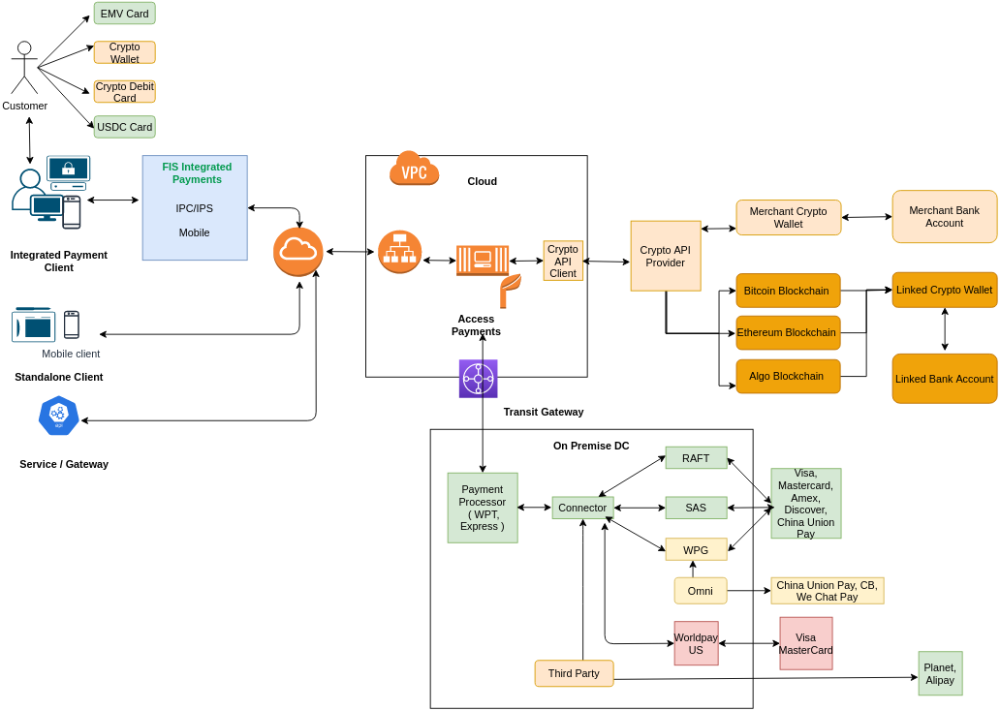
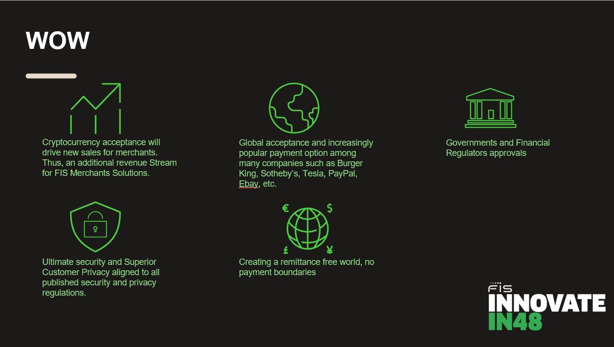

## Problem Statement

Consumers and Merchants are gearing-up for Crypto Currency including Stable Coin Payments and acceptance. However, FIS Merchants Solutions platform is yet to offer platform for accepting crypto payments for retail and ecommerce.

## Solutions Feature:

Our target is to enable Crypto Currency including Stable Coin Payments on FIS Merchants Solutions Payments Platform, which includes but not limited to:

1. Accept Crypto card schemes such as VISA and MASTERCARD Crypto Cards in existing payment flow.
2. Enable Merchants to accept payments in Crypto blockchain, that includes all major crypto currencies i.e. USDC, Bitcoin, Algo, Ether etc.
3. Platform will offer choice to Merchants to get Crypto settlements in Fiat currency or their preferred Crypto wallets.
4. One-click, auto-boarding, and account setup on Crypto platform in-line with GDPR regulations.
5. Enhanced security and privacy with immutable payment.

## Technologies and Architecture Used

1. Technologies used - Microservices, Java, AWS, CI/CD, Spring Boot, Blockchain, DynamoDB, Cognito, MEAN stack.
2. High Level Architecture is as follows:

## Code is designed for:

1. Accepting USDC Crypto payments using Existing APIs.
2. Accepting Crypto (Bitcoin, Ethereum and so on) through new APIs.
3. Parsing, Validation, Decrypting of Crypto inputs.
4. Based on the Wallet and Crypto chain, route to appropriate crypto exchange.
5. For Crypto enabled card payments, route to VISA or MASTERCARD network.
6. Settlements in Fiat or Crypto wallets to Merchants.

## Code is written in

1. JAVA
2. Microservice, REST based
3. Spring/Spring Boot
4. AWS cloud stack
6. Backend - DynamoDB

## Open Source or proprietary software used.

Open Source only.

## Why it’s Cool

1. Crypto Currency ownership increasing 63 percent in 2020 and the Crypto Currency market’s valuation exceeding $2 trillion for first time in April of this year
2. Consumers’ interest in buying and spending Crypto Currency continues to rise, and consumers want to use these currencies to pay for retail purchases
3. Many Merchants are starting to accept Crypto Currencies like UDSC. Example – Visa will enable 70 million Merchants to spend in digital currencies and in first half of 2021 only has processed 1 Billion USD worth transactions.

## WOW

## Cost

| Cost Item | Cost |
| :---:   | :-: | 
| Development cost | 3 Dev + 1QA, 1-2 Months |
| Infrastructure cost | Pay as you go $10 Min|
| Per transaction charges (Provide fee will be paid by merchant) | Card Payment: 2.9% + $0.3, Wallet Payment: USDC free, Partnership fee (As per agreement) |
| Per settlement charges (Provide fee will be paid by merchant) | Domestic- $2, International $25 |
| Operational cost | 1 Dev + 1QA + 1 Cloud Ops(shared) |

## Revenue Projection & Estimate

| Target Addressable Market (TAM) | Notes |
| :---:   | :-: | 
| **At least $20 Billion** | Crypto Currencies including USDC |

1. Estimating out of $20 Billion, FIS being top 10 Global Payment Platform, processes 10% of it i.e. $2 Billion
2. For $2 Billion, FIS is expected to earn:
   - Transaction Processing Fee - Assuming $0.01, it will be $2 million
   - Product Offering Proposition
     - Flat fee of $1 to $5 per POS.
     - Assuming 100,000 POS this would be additional $0.5 million
3. ** Worst case revenue expected is $2.5 million**
4. With growing Crypto Currency TAM and then growing retail percentage of it and then growing FIS market share, upper limit/bound can **$10 million or more in future**.

## Team

